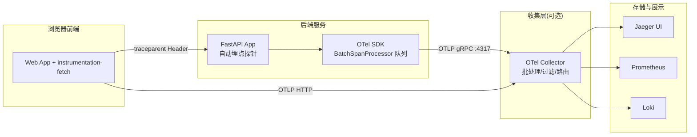
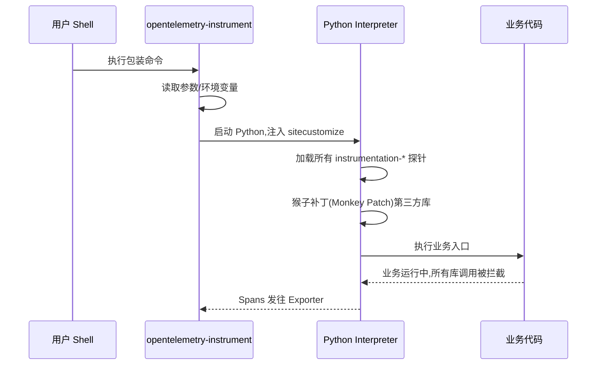
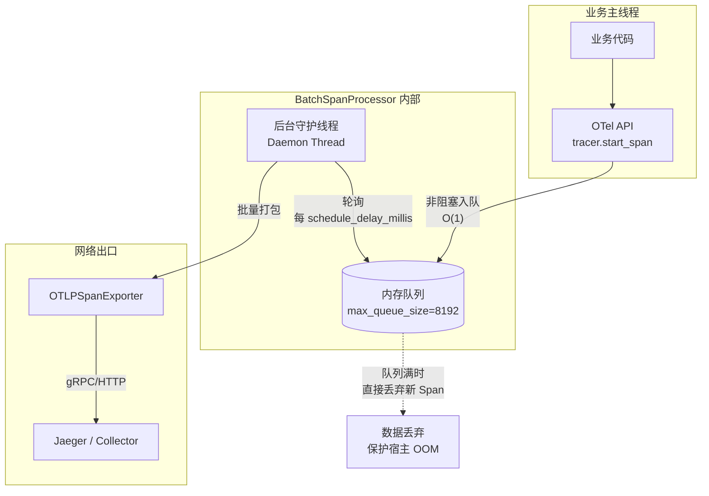
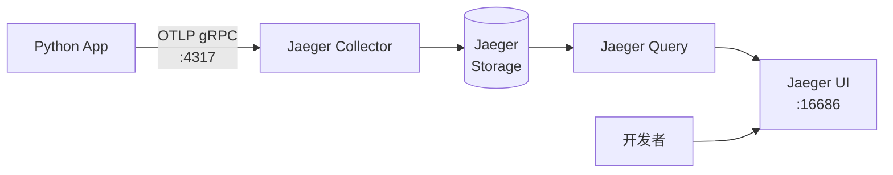
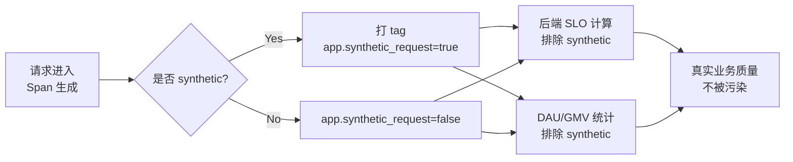
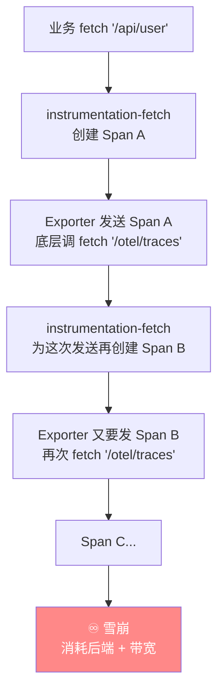
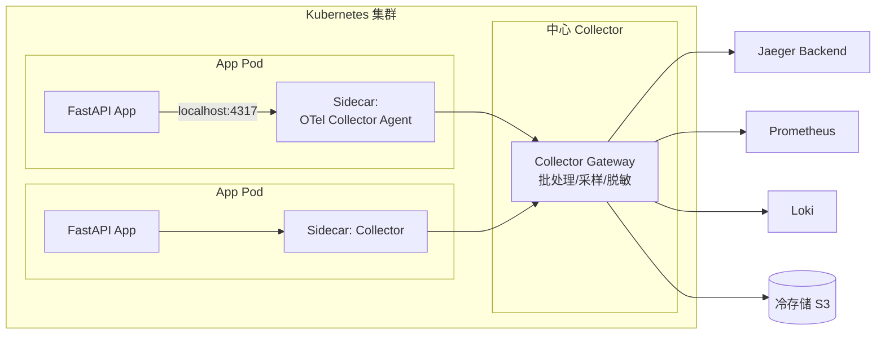

# OpenTelemetry 全链路可观测性工程实践技术报告

> **版本**:1.0
> **适用范围**:Python 后端(FastAPI/Uvicorn)+ 浏览器前端(Web SDK)+ Jaeger/OTLP 后端
> **读者对象**:关注研发效能、微服务治理与系统可观测性的架构师与工程师

---

## 目录

1. [可观测性体系总览](#1-可观测性体系总览)
2. [自动埋点依赖引导:`opentelemetry-bootstrap`](#2-自动埋点依赖引导opentelemetry-bootstrap)
3. [无侵入式启动器:`opentelemetry-instrument`](#3-无侵入式启动器opentelemetry-instrument)
4. [SDK 代码级配置与队列机制剖析](#4-sdk-代码级配置与队列机制剖析)
5. [对接 Jaeger All-in-One(OTLP gRPC)](#5-对接-jaeger-all-in-oneotlp-grpc)
6. [VS Code 联合调试的三种场景](#6-vs-code-联合调试的三种场景)
7. [FastAPI + Uvicorn 自动埋点最佳实践](#7-fastapi--uvicorn-自动埋点最佳实践)
8. [多进程冗余启动下的调试方案](#8-多进程冗余启动下的调试方案)
9. [前端 Web 自动埋点与合成流量识别](#9-前端-web-自动埋点与合成流量识别)
10. [自循环陷阱与 CORS 头注入的安全边界](#10-自循环陷阱与-cors-头注入的安全边界)
11. [生产环境工程化清单](#11-生产环境工程化清单)

---

## 1. 可观测性体系总览

OpenTelemetry(简称 OTel)是 CNCF 毕业的可观测性标准,提供统一的 API、SDK 与协议规范,用于采集 **Traces(追踪)**、**Metrics(指标)**、**Logs(日志)** 三大信号。其核心价值在于**厂商中立**与**协议标准化**——业务代码一次埋点,后端可自由切换 Jaeger、Tempo、Prometheus、Elastic APM、商业 SaaS(Datadog/NewRelic)。

### 1.1 数据流转架构



### 1.2 三大信号的工程定位

| 信号     | 回答的问题         | 代价                     | 采样策略建议           |
| ------ | ------------- | ---------------------- | ---------------- |
| Traces | 某一次请求**为什么慢** | 每 Span 几 KB,易爆炸       | 头部/尾部采样(1%~10%) |
| Metrics | 系统**整体**健康度  | 聚合后极低                  | 全量               |
| Logs   | **具体发生了什么**   | 文本占空间最大               | 按级别过滤            |

---

## 2. 自动埋点依赖引导:`opentelemetry-bootstrap`

### 2.1 这条命令在做什么

```bash
opentelemetry-bootstrap -a install
```

这是 OTel Python 生态中的**依赖扫描器**,核心逻辑分两步:

1. **扫描**:读取当前 Python 环境中 `pip list` 的所有包,与 OTel 官方维护的 `libraries` 映射表比对。
2. **安装**:对每一个匹配到的库(如 Flask、Django、Requests、Redis、SQLAlchemy、Pymongo),自动 `pip install` 对应的 `opentelemetry-instrumentation-<lib>` 探针包。

`-a` 是 `--action` 的简写,可选 `requirements`(仅打印)或 `install`(实际安装)。

### 2.2 完整工作流示例

```bash
# Step 1:先装好你的业务依赖(示例为 FastAPI 项目)
pip install fastapi uvicorn requests sqlalchemy redis httpx

# Step 2:装 OTel 核心 API/SDK 与引导工具
pip install opentelemetry-api opentelemetry-sdk opentelemetry-distro

# Step 3:装 OTLP 导出器(发往 Collector/Jaeger 需要)
pip install opentelemetry-exporter-otlp

# Step 4:预览将安装哪些探针(只打印,不执行)
opentelemetry-bootstrap -a requirements

# Step 5:一键安装所有匹配的探针
opentelemetry-bootstrap -a install
```

### 2.3 执行后产生的效果

假设你装了上面的业务依赖,`bootstrap` 会自动补齐:

```
opentelemetry-instrumentation-fastapi
opentelemetry-instrumentation-asgi
opentelemetry-instrumentation-requests
opentelemetry-instrumentation-sqlalchemy
opentelemetry-instrumentation-redis
opentelemetry-instrumentation-httpx
opentelemetry-instrumentation-urllib3
opentelemetry-instrumentation-logging
```

> **CI/CD 集成建议**:在 `Dockerfile` 中将 `opentelemetry-bootstrap -a install` 固化为构建步骤,确保镜像构建时依赖完备且可复现。

---

## 3. 无侵入式启动器:`opentelemetry-instrument`

### 3.1 命令含义拆解

```bash
opentelemetry-instrument \
    --traces_exporter console \
    --metrics_exporter none \
    --logs_exporter none \
    python server_automatic.py
```

`opentelemetry-instrument` 是一个**进程包装器(Wrapper)**。它的工作原理:



### 3.2 参数详解

| 参数                   | 作用                       | 常用值                          |
| -------------------- | ------------------------ | ---------------------------- |
| `--traces_exporter`  | Traces 发到哪里            | `console` / `otlp` / `none` |
| `--metrics_exporter` | Metrics 发到哪里           | `console` / `otlp` / `none` |
| `--logs_exporter`    | Logs 发到哪里              | `console` / `otlp` / `none` |
| `--service_name`     | 服务名(Jaeger 中的服务标识)  | `my-backend`                 |

**沙盒调试配方**:`traces=console` + 其他两个 `=none`,适合本地验证"探针是否拦截到我关心的库"。

### 3.3 完整可运行示例

**业务代码 `server_automatic.py`**:

```python
# server_automatic.py
from fastapi import FastAPI
import httpx

app = FastAPI()

@app.get("/health")
async def health():
    return {"status": "ok"}

@app.get("/github")
async def github():
    # 这次 httpx 调用会被 OTel 自动拦截为一个 Span
    async with httpx.AsyncClient() as client:
        r = await client.get("https://api.github.com/zen")
        return {"quote": r.text}

if __name__ == "__main__":
    import uvicorn
    uvicorn.run(app, host="127.0.0.1", port=8000)
```

**启动命令**:

```bash
# 控制台模式:用于快速验证探针生效
opentelemetry-instrument \
    --service_name demo-service \
    --traces_exporter console \
    --metrics_exporter none \
    --logs_exporter none \
    python server_automatic.py
```

访问 `http://127.0.0.1:8000/github` 后,终端会打印出形如:

```json
{
    "name": "GET",
    "context": {"trace_id": "0x...", "span_id": "0x..."},
    "kind": "SpanKind.CLIENT",
    "attributes": {
        "http.method": "GET",
        "http.url": "https://api.github.com/zen",
        "http.status_code": 200
    }
}
```

---

## 4. SDK 代码级配置与队列机制剖析

### 4.1 代码级初始化(完整可运行版)

```python
# otel_setup.py —— 统一的初始化模块,应用启动时 import 一次即可
from opentelemetry import trace, metrics
from opentelemetry.sdk.resources import SERVICE_NAME, Resource
from opentelemetry.sdk.trace import TracerProvider
from opentelemetry.sdk.trace.export import BatchSpanProcessor
from opentelemetry.sdk.metrics import MeterProvider
from opentelemetry.sdk.metrics.export import PeriodicExportingMetricReader
from opentelemetry.exporter.otlp.proto.grpc.trace_exporter import OTLPSpanExporter
from opentelemetry.exporter.otlp.proto.grpc.metric_exporter import OTLPMetricExporter
import atexit
import signal
import sys

OTLP_ENDPOINT = "localhost:4317"  # Jaeger / Collector 的 gRPC 端口

# 1. Resource:描述"谁"在上报数据
resource = Resource.create(attributes={
    SERVICE_NAME: "your-service-name",
    "service.version": "1.0.0",
    "deployment.environment": "production",
})

# 2. Tracer:带队列的批量发送处理器
tracer_provider = TracerProvider(resource=resource)
span_processor = BatchSpanProcessor(
    OTLPSpanExporter(endpoint=OTLP_ENDPOINT, insecure=True),
    max_queue_size=8192,            # 队列容量(默认 2048)
    max_export_batch_size=512,      # 单批最大(默认 512)
    schedule_delay_millis=2000,     # 批发送延迟(默认 5000ms)
    export_timeout_millis=30000,    # 单次发送超时(默认 30s)
)
tracer_provider.add_span_processor(span_processor)
trace.set_tracer_provider(tracer_provider)

# 3. Meter:周期性批量导出指标
metric_reader = PeriodicExportingMetricReader(
    OTLPMetricExporter(endpoint=OTLP_ENDPOINT, insecure=True),
    export_interval_millis=60000,   # 导出间隔(默认 60s)
)
meter_provider = MeterProvider(resource=resource, metric_readers=[metric_reader])
metrics.set_meter_provider(meter_provider)

# 4. 优雅停机:保证内存队列中的数据不丢
def _graceful_shutdown(*_):
    """捕获 SIGTERM/SIGINT,刷出队列中的残留数据"""
    tracer_provider.shutdown()
    meter_provider.shutdown()
    sys.exit(0)

atexit.register(lambda: (tracer_provider.shutdown(), meter_provider.shutdown()))
signal.signal(signal.SIGTERM, _graceful_shutdown)
signal.signal(signal.SIGINT, _graceful_shutdown)
```

### 4.2 队列的内部机制



### 4.3 对业务的影响矩阵

| 场景          | 影响                                            | 应对                                      |
| ----------- | --------------------------------------------- | --------------------------------------- |
| 正常流量      | 零阻塞,仅内存写入                                  | 无需干预                                  |
| 流量洪峰      | 队列打满,新 Span 被丢弃(保护应用不 OOM)         | 调大 `max_queue_size` / 缩短 `schedule_delay_millis` |
| 网络抖动      | 后台线程重试,队列堆积                            | 部署本地 Collector 做一层缓冲                |
| `kill -9`   | 队列中未发送的数据**永久丢失**                    | 无解,但避免粗暴 kill;用 SIGTERM          |
| 正常退出      | `atexit`/`signal` 触发 `shutdown` 刷出队列       | 显式注册 hook(如上方代码示例)              |

> **架构师提示**:`BatchSpanProcessor` 的队列机制本质是"**写优化** vs **数据完整性**"的取舍。OTel 选择了保护宿主应用——**宁可丢监控数据,也绝不拖累业务**。这是所有可观测性 SDK 的黄金法则。

---

## 5. 对接 Jaeger All-in-One(OTLP gRPC)

### 5.1 关键认知转换

> **OTel 官方已废弃原生的 `jaeger-exporter`**。新版 Jaeger(≥ 1.35)原生支持 OTLP 协议,直接用 `otlp` 导出器即可。

### 5.2 Jaeger 启动(Docker)

```bash
docker run -d --name jaeger \
  -e COLLECTOR_OTLP_ENABLED=true \
  -p 16686:16686 \
  -p 4317:4317 \
  -p 4318:4318 \
  jaegertracing/all-in-one:latest
```

| 端口  | 用途                    |
| ----- | --------------------- |
| 16686 | Jaeger UI(浏览器访问) |
| 4317  | OTLP gRPC 接收        |
| 4318  | OTLP HTTP 接收        |

### 5.3 完整启动命令

```bash
# 本地 Jaeger(默认 localhost:4317)
opentelemetry-instrument \
    --service_name demo-service \
    --traces_exporter otlp \
    --metrics_exporter none \
    --logs_exporter none \
    python server_automatic.py

# 远程 Jaeger:通过环境变量配置
export OTEL_EXPORTER_OTLP_ENDPOINT="http://jaeger.internal.corp:4317"
export OTEL_SERVICE_NAME="demo-service"
opentelemetry-instrument \
    --traces_exporter otlp \
    --metrics_exporter none \
    --logs_exporter none \
    python server_automatic.py
```

### 5.4 整体数据流



---

## 6. VS Code 联合调试的三种场景

VS Code 的 `debugpy` 与 `opentelemetry-instrument` 本质上都是**进程包装器**,若在终端裸跑 OTel 命令,Debugger 根本挂载不上。正确做法是让 Debugger 启动 OTel 模块。

### 6.1 场景 A:纯脚本应用(单进程)

**`.vscode/launch.json`**:

```json
{
    "version": "0.2.0",
    "configurations": [
        {
            "name": "Python: Debug with OTel (script)",
            "type": "debugpy",
            "request": "launch",
            "module": "opentelemetry.instrumentation.auto_instrumentation",
            "args": [
                "python",
                "${workspaceFolder}/server_automatic.py"
            ],
            "env": {
                "OTEL_SERVICE_NAME": "debug-service",
                "OTEL_TRACES_EXPORTER": "console",
                "OTEL_METRICS_EXPORTER": "none",
                "OTEL_LOGS_EXPORTER": "none"
            },
            "console": "integratedTerminal",
            "justMyCode": true
        }
    ]
}
```

### 6.2 场景 B:FastAPI + Uvicorn(单 Worker)

```json
{
    "version": "0.2.0",
    "configurations": [
        {
            "name": "FastAPI: Debug with OTel (single worker)",
            "type": "debugpy",
            "request": "launch",
            "module": "opentelemetry.instrumentation.auto_instrumentation",
            "args": [
                "uvicorn",
                "main:app",
                "--host", "127.0.0.1",
                "--port", "8000"
            ],
            "env": {
                "OTEL_SERVICE_NAME": "fastapi-debug",
                "OTEL_TRACES_EXPORTER": "otlp",
                "OTEL_EXPORTER_OTLP_ENDPOINT": "http://localhost:4317",
                "OTEL_METRICS_EXPORTER": "none",
                "OTEL_LOGS_EXPORTER": "none"
            },
            "console": "integratedTerminal",
            "justMyCode": true
        }
    ]
}
```

> **禁忌**:**绝不在 args 里加 `--reload`**。`--reload` 会 fork 子进程,Debugger 只挂在父进程,断点永不命中。

### 6.3 场景 C:同时调试业务 + OTel 源码

将 `justMyCode` 改为 `false`,即可 Step Into 到 `opentelemetry-*` 包的源码中,适合排查"为什么这个库没被拦截"。

---

## 7. FastAPI + Uvicorn 自动埋点最佳实践

### 7.1 两种接入方式对比

| 维度         | CLI 无侵入式<br/>(`opentelemetry-instrument`) | 代码级半自动<br/>(`FastAPIInstrumentor`) |
| ---------- | ------------------------------------------ | ------------------------------------- |
| 启动命令复杂度  | 高(嵌套包装)                                 | 低(原生 `uvicorn main:app`)           |
| 调试友好度    | 中                                          | 高                                     |
| 粒度控制      | 全量,难定制                                  | 精细(可排除 `/health`、`/metrics`)    |
| 多进程稳定性   | **不稳定**                                   | **稳定**                                |
| 推荐场景      | 快速验证、Demo                                | 生产环境                                |

### 7.2 推荐:代码级半自动埋点(生产级完整示例)

```python
# main.py —— FastAPI 生产级 OTel 接入
from fastapi import FastAPI, Request
from fastapi.responses import JSONResponse
from opentelemetry import trace
from opentelemetry.instrumentation.fastapi import FastAPIInstrumentor
from opentelemetry.instrumentation.httpx import HTTPXClientInstrumentor

# 引入我们在第 4 章写好的初始化模块
import otel_setup  # noqa: F401 —— import 即完成 Provider 注册

app = FastAPI(title="Production Service")
tracer = trace.get_tracer(__name__)

# ---- 业务路由 ----
@app.get("/health")
async def health():
    return {"status": "ok"}

@app.get("/metrics")
async def metrics_endpoint():
    return {"rps": 100}

@app.get("/api/users/{user_id}")
async def get_user(user_id: int):
    # 手动创建子 Span,补充业务语义
    with tracer.start_as_current_span("db.query.user") as span:
        span.set_attribute("app.user_id", user_id)
        span.set_attribute("db.system", "postgresql")
        # ...业务逻辑...
        return {"id": user_id, "name": "Alice"}

# ---- 挂载 OTel 探针(关键一步) ----
FastAPIInstrumentor.instrument_app(
    app,
    # 排除健康检查和监控端点,避免噪声
    excluded_urls="health,metrics",
    # 为每个 Span 附加自定义属性
    server_request_hook=lambda span, scope: span.set_attribute(
        "app.request_id", scope.get("headers", {})
    ) if span and span.is_recording() else None,
)
HTTPXClientInstrumentor().instrument()

if __name__ == "__main__":
    import uvicorn
    uvicorn.run(app, host="0.0.0.0", port=8000)
```

**启动(生产)**:

```bash
# 生产环境:多 Worker,代码级埋点
gunicorn main:app \
    -w 4 \
    -k uvicorn.workers.UvicornWorker \
    --bind 0.0.0.0:8000
```

---

## 8. 多进程冗余启动下的调试方案

### 8.1 为什么会有多级子进程

```mermaid
flowchart TB
    SHELL[Shell] --> U[Uvicorn Master<br/>主进程<br/>监听文件变化]
    U -. fork/spawn .-> W1[Worker 1<br/>子进程<br/>实际处理请求]
    U -. fork/spawn .-> W2[Worker 2<br/>子进程]
    U -. fork/spawn .-> W3[Worker N<br/>子进程]

    DBG[Debugger<br/>默认只挂父进程] -.挂载.-> U
    DBG -. "需要 subProcess=true<br/>才能穿透" .-> W1
    DBG -. .-> W2
    DBG -. .-> W3

    style W1 fill:#fdd
    style W2 fill:#fdd
    style W3 fill:#fdd
```

### 8.2 VS Code 穿透配置

```json
{
    "version": "0.2.0",
    "configurations": [
        {
            "name": "FastAPI: Reload + Multi-Worker + OTel",
            "type": "debugpy",
            "request": "launch",
            "module": "uvicorn",
            "args": [
                "main:app",
                "--reload",
                "--workers", "2",
                "--host", "127.0.0.1",
                "--port", "8000"
            ],
            "subProcess": true,
            "env": {
                "OTEL_SERVICE_NAME": "multi-worker-service",
                "OTEL_TRACES_EXPORTER": "otlp",
                "OTEL_EXPORTER_OTLP_ENDPOINT": "http://localhost:4317",
                "OTEL_METRICS_EXPORTER": "none",
                "OTEL_LOGS_EXPORTER": "none",
                "PYTHONUNBUFFERED": "1"
            },
            "console": "integratedTerminal",
            "justMyCode": true
        }
    ]
}
```

### 8.3 关键工程决策

| 叠加组合                                            | 是否推荐     | 原因                                                  |
| ----------------------------------------------- | -------- | --------------------------------------------------- |
| `opentelemetry-instrument` + `--reload` + debug | ❌ 强烈不建议 | fork 后 OTel 状态污染、gRPC 连接被破坏、线程死锁                   |
| **代码级埋点** + `--reload` + `subProcess: true`     | ✅ 推荐    | OTel 在 Worker 内部初始化,每个子进程状态独立,Debugger 自然穿透 |
| 代码级埋点 + `gunicorn -w 4`(生产)                    | ✅ 推荐    | 生产首选,Worker 进程隔离性强                                 |

**核心原则**:**进程 fork 前不要初始化任何持有资源的 OTel 对象**(如 gRPC channel、后台线程)。把初始化延迟到 Worker 内部,是解决一切多进程监控问题的银弹。

---

## 9. 前端 Web 自动埋点与合成流量识别

### 9.1 合成请求(Synthetic Request)的业务背景

生产环境的流量可粗分为两类:

- **Real User Traffic**:真人在浏览器/App 里的操作。
- **Synthetic Traffic**:
  - E2E 自动化测试(Playwright/Cypress)
  - 运维拨测探针(Pingdom / 阿里云拨测)
  - 压测流量(k6、Locust)
  - 搜索引擎爬虫

**为什么要标识它们?**



### 9.2 `applyCustomAttributesOnSpan` 的作用

原始英文说明的工程含义:

> 为了在后端服务中**延续**(carry over)`synthetic_request` 属性标记,`applyCustomAttributesOnSpan` 配置回调已被加入 `instrumentation-fetch` 的自定义 Span 属性逻辑中。这样**每一个**浏览器端 Span 都会带上它。

换言之,这是一个**注入钩子(hook)**,在浏览器生成 Span 的瞬间,把自定义 Key-Value 塞进 attributes,随 W3C Trace Context(`traceparent` header)一路透传到后端,后端从而知道"这条链路是合成流量"。

---

## 10. 自循环陷阱与 CORS 头注入的安全边界

### 10.1 自循环风暴:前端 OTel 最隐蔽的坑



### 10.2 完整修复版前端代码

```typescript
// frontend-tracer.ts —— 生产级 Web 端 OTel 初始化
import {
    CompositePropagator,
    W3CBaggagePropagator,
    W3CTraceContextPropagator,
} from '@opentelemetry/core';
import { WebTracerProvider } from '@opentelemetry/sdk-trace-web';
import { BatchSpanProcessor } from '@opentelemetry/sdk-trace-base';
import { registerInstrumentations } from '@opentelemetry/instrumentation';
import { getWebAutoInstrumentations } from '@opentelemetry/auto-instrumentations-web';
import { resourceFromAttributes } from '@opentelemetry/resources';
import { ATTR_SERVICE_NAME } from '@opentelemetry/semantic-conventions';
import { OTLPTraceExporter } from '@opentelemetry/exporter-trace-otlp-http';

const FrontendTracer = async () => {
    const { ZoneContextManager } = await import('@opentelemetry/context-zone');

    // —— 动态构建"本公司主域名"的安全正则 ——
    // 场景:当前是 app.mycompany.com,自动匹配 *.mycompany.com
    const hostnameParts = window.location.hostname.split('.');
    const rootDomain = hostnameParts.length > 2
        ? hostnameParts.slice(-2).join('.')
        : window.location.hostname;
    const safeCorsUrls = new RegExp(
        `^https?://([a-zA-Z0-9-]+\\.)*${rootDomain.replace(/\./g, '\\.')}/.*`
    );

    // —— 自循环屏蔽清单 ——
    const otelSelfUrls = [
        /\/otel\/.*/,                        // 本站 /otel 路径
        /\/v1\/traces$/,                     // 标准 OTLP HTTP 路径
        /\/v1\/metrics$/,
        /\/v1\/logs$/,
    ];

    const provider = new WebTracerProvider({
        resource: resourceFromAttributes({
            [ATTR_SERVICE_NAME]: process.env.NEXT_PUBLIC_OTEL_SERVICE_NAME || 'web-frontend',
        }),
        // 生产环境用 Batch 而非 Simple,减少网络抖动
        spanProcessors: [
            new BatchSpanProcessor(
                new OTLPTraceExporter({
                    url: '/otel/v1/traces',
                }),
                {
                    maxQueueSize: 2048,
                    scheduledDelayMillis: 3000,
                    maxExportBatchSize: 256,
                }
            ),
        ],
    });

    provider.register({
        contextManager: new ZoneContextManager(),
        propagator: new CompositePropagator({
            propagators: [
                new W3CBaggagePropagator(),
                new W3CTraceContextPropagator(),
            ],
        }),
    });

    registerInstrumentations({
        tracerProvider: provider,
        instrumentations: [
            getWebAutoInstrumentations({
                '@opentelemetry/instrumentation-fetch': {
                    // ✅ 修复 1:屏蔽 OTel 自身请求,防止自循环
                    ignoreUrls: otelSelfUrls,

                    // ✅ 修复 2:仅向本公司域名注入 traceparent
                    //   禁止向 Google Analytics / Stripe / 三方 CDN 泄漏
                    propagateTraceHeaderCorsUrls: [safeCorsUrls],

                    clearTimingResources: true,

                    // ✅ 标记合成流量
                    applyCustomAttributesOnSpan(span) {
                        const ua = navigator.userAgent.toLowerCase();
                        const isSynthetic =
                            /headlesschrome|phantomjs|playwright|selenium|puppeteer/.test(ua);
                        span.setAttribute('app.synthetic_request', String(isSynthetic));
                        span.setAttribute('app.page_url', window.location.href);
                    },
                },
                '@opentelemetry/instrumentation-xml-http-request': {
                    ignoreUrls: otelSelfUrls,
                    propagateTraceHeaderCorsUrls: [safeCorsUrls],
                },
                // 禁用噪声过大的探针
                '@opentelemetry/instrumentation-document-load': { enabled: true },
                '@opentelemetry/instrumentation-user-interaction': { enabled: false },
            }),
        ],
    });
};

export default FrontendTracer;
```

### 10.3 `propagateTraceHeaderCorsUrls` 的三档配置策略

| 配置                                  | 安全性     | 适用场景                         |
| ----------------------------------- | ------- | ---------------------------- |
| **删除该字段**                          | ★★★★★  | 前后端完全同源(同域名同端口)         |
| `[safeCorsUrls]`(动态匹配主域)         | ★★★★   | 生产首选,前后端子域分离            |
| `/.*/`                              | ☆☆☆☆☆  | **禁止使用**                    |

**为什么 `/.*/` 是灾难**:

1. 向 Google Analytics / 支付网关 / CDN 等所有三方请求强行注入 `traceparent` header。
2. 三方服务器的 CORS 预检中未声明允许该 header → **OPTIONS preflight 失败 → 业务彻底瘫痪**。
3. 向外泄漏内部 Trace ID,潜在的安全/合规风险。

---

## 11. 生产环境工程化清单

### 11.1 部署拓扑建议



### 11.2 Checklist

- [ ] `opentelemetry-bootstrap -a install` 已写入 `Dockerfile`
- [ ] `BatchSpanProcessor` 配置了 `max_queue_size` 与 `schedule_delay_millis`
- [ ] 应用优雅停机(SIGTERM)时调用 `TracerProvider.shutdown()`
- [ ] 生产环境**不**使用 `opentelemetry-instrument` CLI,改用代码级埋点
- [ ] `--reload` **仅限**本地开发,生产用 `gunicorn -w N` 多 Worker
- [ ] VS Code 多进程调试开启 `subProcess: true`
- [ ] 前端 `ignoreUrls` 屏蔽所有 `/v1/traces`、`/v1/metrics`、`/v1/logs`
- [ ] 前端 `propagateTraceHeaderCorsUrls` **严禁** `/.*/`,使用白名单
- [ ] 健康检查端点(`/health`、`/metrics`)加入 `excluded_urls`
- [ ] Trace 采样策略:入口服务头部采样 10%,尾部采样保留错误请求
- [ ] `service.name` / `deployment.environment` / `service.version` 三件套齐全
- [ ] 关键业务 Span 补充 `app.*` 自定义属性(用户 ID、订单号等)
- [ ] 合成流量识别链路贯通(前端 UA 判断 → Span attr → 后端 SLO 过滤)

### 11.3 常见故障速查表

| 现象                                    | 排查方向                                     |
| ------------------------------------- | ---------------------------------------- |
| 后端 Jaeger 里没数据                      | ① 检查 `4317` 端口连通性<br/>② 确认 `insecure=True`<br/>③ `export OTEL_LOG_LEVEL=debug` 查导出日志 |
| 断点进不去                                | ① 关 `--reload`<br/>② `subProcess: true`<br/>③ 检查是否用了 OTel CLI 包装 |
| 前端 CORS 请求被拦                        | ① 检查 `propagateTraceHeaderCorsUrls` 是否过宽<br/>② 三方服务未允许 `traceparent` header |
| Trace 数据暴涨,存储告警                   | ① 调整采样率<br/>② 在 Collector 配置 tail_sampling<br/>③ 过滤高频健康检查 |
| 进程退出后少量数据丢失                     | ① 注册 `atexit` 调 `shutdown`<br/>② 使用 K8s `preStop` hook 延迟 5 秒 |
| 多 Worker 下 Span 断链                   | ① 确保 OTel 在 Worker **内部**初始化,而非 Master<br/>② 检查 Context Propagation 配置 |

---

## 结语

OpenTelemetry 的学习曲线并不陡峭,但**工程化落地**需要在以下四个维度反复打磨:

1. **正确性**:数据采全、链路不断、属性语义对齐 OTel Semantic Conventions。
2. **稳定性**:队列不阻塞主流程、进程退出不丢数据、监控系统自身不引发故障。
3. **性能**:采样策略合理、Batch 参数适配业务 QPS、Collector 做好减压。
4. **安全**:不向三方泄漏 Trace ID、屏蔽自循环、脱敏敏感字段。

建立可观测性不是上线一个 Agent 就算完成,而是一套**持续演进的工程体系**。希望这份报告能成为你团队在这条路径上的一份可执行的工程地图。

---

*— End of Report —*
